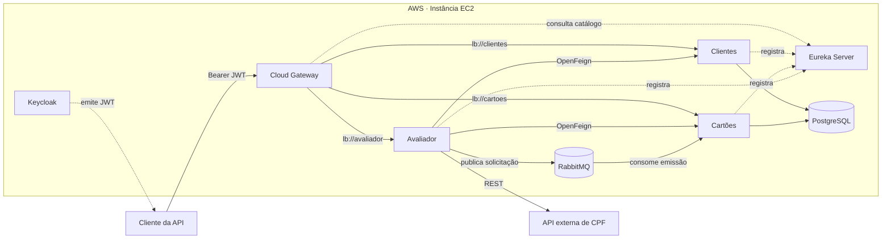
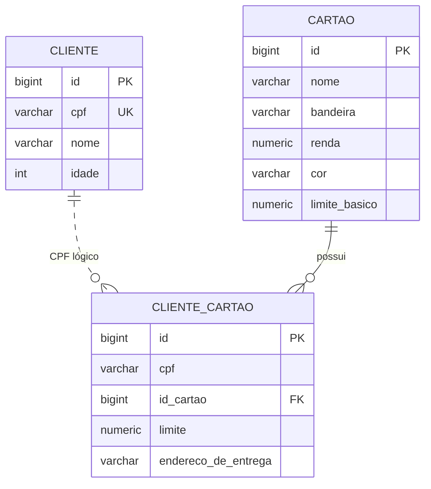

<div align="center">

# Lumen

Plataforma financeira baseada em microsserviços modulares, DDD e entrega contínua na AWS.

**CD preparado para implantar o Compose em uma instância EC2 após o CI.**


</div>

## Visão geral

O Lumen divide o domínio financeiro em microsserviços modulares. Cada serviço representa um contexto do negócio, mantém seu modelo e pode ser construído e publicado separadamente. O gateway autentica as requisições, o Eureka mantém o catálogo de instâncias e o serviço `avaliador` coordena clientes, cartões, consulta externa de CPF e emissão assíncrona.

O GitHub Actions executa CI e, após sucesso em `main`, implanta o Compose em uma EC2. Credenciais e segredos ficam fora do código-fonte.

## DDD e modularidade

| Camada | Papel |
| --- | --- |
| `domain` | Modelos, entidades, enums e vocabulário de cada contexto. |
| `application` | Casos de uso, serviços, controllers, DTOs e mapeamentos. |
| `infra` | Persistência, mensageria e integrações HTTP. |

`clientes`, `cartoes` e `avaliador` formam os contextos de negócio. `cloudgateway` e `eurekaserver` sustentam comunicação e descoberta. O módulo `modular` agrega os projetos no build Maven multi-module sem criar outro serviço em produção.

## Arquitetura



### Serviços

| Componente | Responsabilidade |
| --- | --- |
| `cloudgateway` | Ponto de entrada, validação OAuth2/JWT e roteamento com balanceamento pelo Eureka. |
| `eurekaserver` | Service discovery protegido por HTTP Basic. |
| `clientes` | Cadastro e consulta de clientes por CPF. |
| `cartoes` | Catálogo de cartões, regras por renda e persistência dos cartões emitidos. |
| `avaliador` | Avaliação de crédito, consulta externa de CPF e coordenação da emissão. |
| `modular` | Agregador Maven dos cinco módulos; não sobe como serviço no Compose. |

Comunicação síncrona usa HTTP/OpenFeign; emissão usa RabbitMQ.

### Fluxo de emissão

1. Gateway valida o JWT e encaminha a solicitação ao `avaliador`.
2. Avaliador normaliza o CPF, consulta ou cadastra o cliente e valida idade, renda e cartão.
3. Avaliador calcula o limite e publica a solicitação na fila `emissao-cartoes`.
4. Publicador aguarda confirmação do RabbitMQ antes de responder com `202 Accepted`.
5. `cartoes` consome a mensagem e grava a associação entre CPF e cartão.
6. Restrição única `(cpf, id_cartao)` torna o consumo idempotente. Mensagens inválidas ou falhas esgotadas seguem para a DLQ.

## Modelagem de dados



`clientes` e `cartoes` são donos de seus próprios dados. A referência ao cliente em `cliente_cartao` é lógica pelo CPF, sem chave estrangeira entre serviços. As tabelas são criadas e validadas por migrations Flyway.

## Tecnologias

| Área | Tecnologias |
| --- | --- |
| Linguagem e build | Java 21, Maven Wrapper, Lombok |
| Aplicação | Spring Boot, Spring MVC, WebFlux, Spring Data JPA |
| Microsserviços | Spring Cloud Gateway, Netflix Eureka, OpenFeign |
| Segurança | Spring Security, OAuth2 Resource Server, JWT, Keycloak |
| Dados | PostgreSQL, Hibernate, Flyway |
| Mensageria | RabbitMQ, Spring AMQP, publisher confirms, retry e dead-letter queue |
| Arquitetura | DDD, microsserviços modulares, Maven multi-module |
| Infraestrutura | Docker, Docker Compose, AWS, imagens Eclipse Temurin Alpine |
| Qualidade e entrega | JUnit, Spring Test e GitHub Actions CI/CD |

## Como executar

### Pré-requisitos

- Docker com Docker Compose
- Portas `5433`, `5672`, `8080`, `8081`, `8761` e `15672` livres

### Subir o ambiente

```bash
export EUREKA_PASSWORD='<senha-do-eureka>'
docker compose up --build
```

`RAPIDAPI_KEY` é opcional. Sem ela, a consulta externa de CPF fica indisponível, mas clientes já cadastrados continuam acessíveis. Para ativá-la no Docker, repasse a variável ao serviço `avaliador` no Compose.

> [!IMPORTANT]
> O Compose inicia o Keycloak, mas não cria o realm. Antes de chamar a API, acesse `http://localhost:8081`, crie o realm `msrealm` e configure um cliente capaz de emitir JWT.

> [!WARNING]
> Não registre credenciais no repositório. Forneça todos os segredos por variáveis ou pelo ambiente de implantação.

### Serviços locais

| Serviço | Endereço |
| --- | --- |
| API Gateway | `http://localhost:8080` |
| Eureka | `http://localhost:8761` |
| Keycloak | `http://localhost:8081` |
| RabbitMQ Management | `http://localhost:15672` |
| PostgreSQL | `localhost:5433/lumen` |

## API

Todas as rotas externas passam pelo gateway e exigem `Authorization: Bearer <token>`.

| Método | Rota | Função |
| --- | --- | --- |
| `POST` | `/api/clientes` | Cadastra cliente com `cpf`, `nome` e `idade`. |
| `GET` | `/api/clientes?cpf={cpf}` | Consulta cliente por CPF. |
| `POST` | `/api/cartoes` | Cadastra cartão e sua renda mínima. |
| `GET` | `/api/cartoes/{id}` | Consulta cartão por ID. |
| `GET` | `/api/cartoes?renda={valor}` | Lista cartões compatíveis com a renda. |
| `GET` | `/api/cartoes?cpf={cpf}` | Lista cartões emitidos para o cliente. |
| `POST` | `/api/avaliador` | Calcula limite a partir de idade, renda e limite básico. |
| `GET` | `/api/avaliador/situacao?cpf={cpf}` | Consolida dados do cliente e cartões emitidos. |
| `POST` | `/api/avaliador/solicitacoes` | Valida e envia uma emissão de cartão para o RabbitMQ. |

Exemplo de solicitação:

```bash
curl -X POST http://localhost:8080/api/avaliador/solicitacoes \
  -H "Authorization: Bearer $TOKEN" \
  -H 'Content-Type: application/json' \
  -d '{
    "cpf": "12345678900",
    "rendaMensal": 8000,
    "cartaoId": 1,
    "enderecoDeEntrega": "Rua Exemplo, 100"
  }'
```

## Testes

Com Java 21 instalado, execute todos os módulos pelo agregador Maven:

```bash
./modular/mvnw -f modular/pom.xml verify
```

O workflow de CI executa `mvn verify` para cada microsserviço com PostgreSQL e RabbitMQ de apoio.

## CD na EC2

O workflow [CD](.github/workflows/cd.yaml) roda depois que o CI de um `push` em `main` passa. Ele envia o commit aprovado por SSH, cria uma pasta de release e executa `docker compose up -d --build --wait`. Um CI reexecutado para commit antigo não substitui o deploy mais recente. Os volumes `lumen_postgres_data`, `lumen_rabbitmq_data` e `lumen_keycloak` persistem entre releases.

### Preparar a instância

1. Crie uma EC2 Linux com espaço e memória suficientes para construir cinco imagens Java. Instale Docker Engine com o plugin Compose e conceda acesso ao Docker ao usuário de deploy. Esse acesso equivale a privilégio de administrador na instância.
2. Permita SSH (`22`) a partir do runner do GitHub Actions e do seu IP administrativo. Os IPs dos runners hospedados pelo GitHub variam; use runner próprio ou SSM se precisar de uma regra de entrada fixa. O Compose publica todas as portas em `127.0.0.1`; use túnel SSH para testes. Para acesso público, configure HTTPS e proxy reverso antes de liberar tráfego externo.
3. No usuário de deploy, crie `~/lumen/.env` com permissão `600`:

   ```dotenv
   POSTGRES_PASSWORD=<senha-forte>
   RABBITMQ_PASSWORD=<senha-forte>
   EUREKA_PASSWORD=<senha-alfanumerica-sem-caracteres-de-URL>
   KEYCLOAK_ADMIN_PASSWORD=<senha-forte>
   JWT_ISSUER_URI=http://localhost:8081/realms/msrealm
   # RAPIDAPI_KEY=<chave-opcional>
   ```

   Use `umask 077` ao criar o arquivo. `JWT_ISSUER_URI` deve ser exatamente o `iss` dos tokens do Keycloak. O exemplo funciona com túnel SSH; para domínio público, ajuste essa variável e o endereço público do Keycloak. Faça backup dos volumes antes de atualizar versões que alterem dados. Após a primeira inicialização do PostgreSQL, trocar `POSTGRES_PASSWORD` no `.env` não altera a senha do banco existente; faça a rotação no banco antes de atualizar o arquivo.

4. Crie o ambiente `production` no GitHub. Os secrets `AWS_HOST` (IP ou DNS), `AWS_USER` e `AWS_SSH_KEY` podem ficar em **Repository secrets**. Adicione `AWS_KNOWN_HOSTS` com a linha verificada da chave SSH da instância. A chave pública correspondente a `AWS_SSH_KEY` deve estar em `~/.ssh/authorized_keys` na EC2. Não use `ssh-keyscan` no workflow sem confirmar a impressão digital por um canal confiável.

Após o primeiro deploy, confira `docker compose --env-file ~/lumen/.env -p lumen -f ~/lumen/current/docker-compose.yml ps` na EC2. Para acessar gateway e Keycloak durante testes:

```bash
ssh -L 8080:127.0.0.1:8080 -L 8081:127.0.0.1:8081 <usuario>@<host-ec2>
```

O Keycloak atual usa `start-dev` e precisa que o realm `msrealm` seja criado. Este CD serve para implantação privada e testes. Antes de tráfego público, configure Keycloak em modo de produção com banco persistente próprio, HTTPS, domínio estável e backup; o workflow não provisiona esses recursos.
